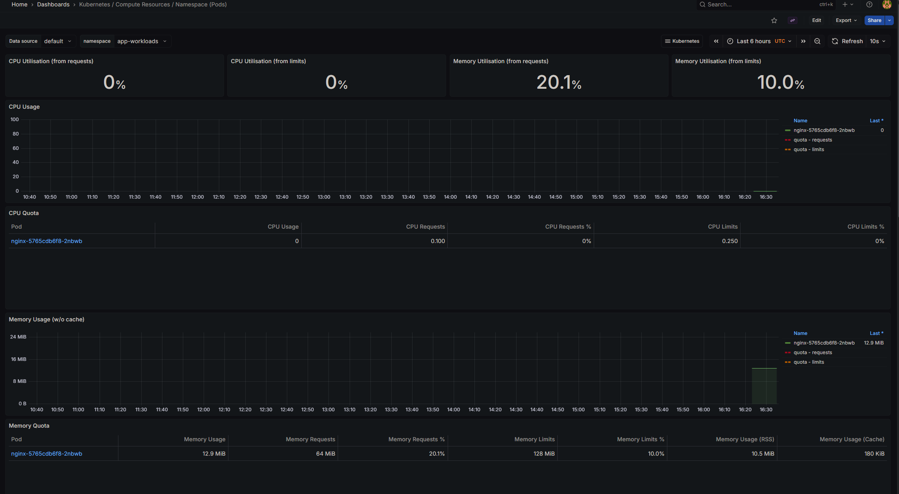
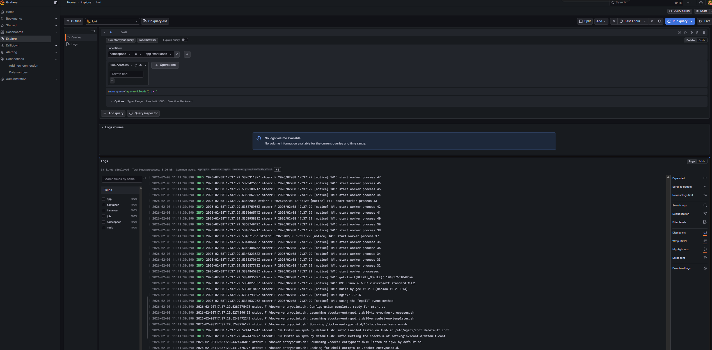

# securek8s-lab

## Description 
Kubernetes security lab — RBAC, network policies, admission control, container image scanning, and runtime threat detection for a containerized SIEM stack.


### Logging Pipeline
```
Container logs ──► Fluent Bit (per node) ──► Loki ──► Grafana Explore
```





## Tools & Technologies

**Cluster:** Kind, Calico CNI, Docker Desktop
**Monitoring:** Prometheus, Grafana, Loki, Fluent Bit, Alertmanager
**Security:** RBAC, NetworkPolicy, Pod Security Standards, Resource Quotas, Audit Logging
**Deployment:** Helm, kubectl, YAML manifests

## NIST 800-53 Controls Mapping

| Control | Family | Implementation |
|---------|--------|----------------|
| AC-6 | Least Privilege | RBAC roles scoped to specific namespaces and verbs |
| AC-17 | Remote Access | kubectl exec restricted via RBAC, detected via audit logs |
| AU-2 | Audit Events | API server audit logging with tiered policy |
| AU-3 | Content of Audit Records | Audit logs capture who, what, when, and authorization decision |
| CM-7 | Least Functionality | Pod Security Standards enforce restricted profile |
| SC-6 | Resource Availability | Resource quotas prevent namespace-level resource starvation |
| SC-7 | Boundary Protection | Network policies enforce micro-segmentation between namespaces |
| SI-4 | System Monitoring | Prometheus metrics + Loki log aggregation + Grafana dashboards |
