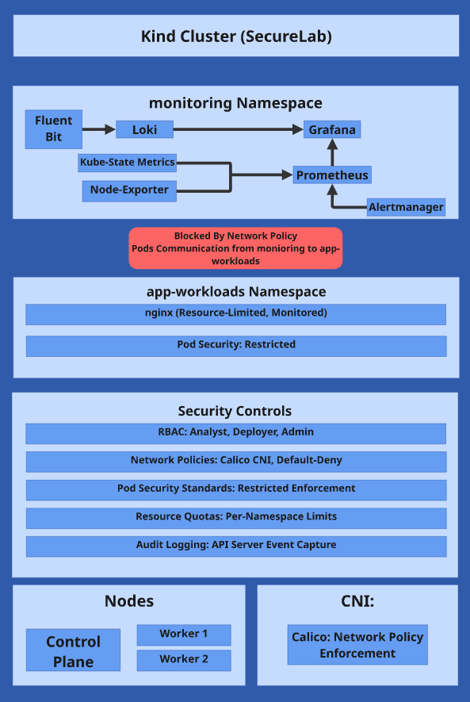
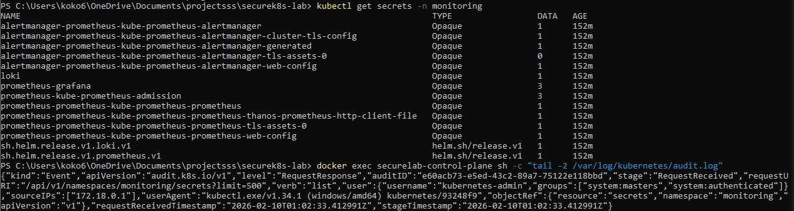

# SecureK8s Lab

Hands-on Kubernetes security lab that demonstrates cluster hardening, observability, and threat detection for a containerized SIEM stack using real-world controls and production-inspired tooling. The lab is built from scratch to simulate how security teams protect, monitor, and validate workloads in modern Kubernetes environments, with all configurations version-controlled and mapped to industry frameworks.

---
## Key points

* Built from scratch with Kind and Calico

* Implements RBAC, network policies, Pod Security Standards, and admission controls

* Adds resource quotas and API server audit logging for hardening

* Deploys a full monitoring stack via Helm (Prometheus, Grafana, Loki, Fluent Bit)

* Maps security controls to NIST 800-53

* Version-controlled configs with documented testing and results
---

## Architecture



---

## What's Deployed

| Component | Purpose | Deployment Method |
|-----------|---------|-------------------|
| Prometheus | Metrics collection and storage | Helm (kube-prometheus-stack) |
| Grafana | Dashboard and visualization | Helm (bundled with Prometheus) |
| Loki | Log aggregation and indexing | Helm (loki-stack) |
| Fluent Bit | Log collection from all nodes | Helm (bundled with Loki) |
| Alertmanager | Alert routing and notification | Helm (bundled with Prometheus) |
| Kube-state-metrics | K8s object state metrics | Helm (bundled with Prometheus) |
| Node-exporter | Hardware/OS metrics per node | Helm (bundled with Prometheus) |
| Calico | CNI with network policy enforcement | kubectl apply |
| Nginx | Sample workload for testing | kubectl create deployment |

---

## Security Controls

### RBAC — Least-Privilege Access
Three roles enforcing different access levels across namespaces:
- **SOC Analyst** — read-only access to monitoring namespace (pods, logs, services, configmaps)
- **Deployer** — create/update in app-workloads but cannot delete
- **Admin** — full cluster access across all namespaces

All tested with `--as` flag impersonation. Delete attempts by analyst and deployer returned **Forbidden**.


### Network Policies — Micro-Segmentation with Calico
Cluster rebuilt with Calico CNI to enforce real network policy rules (kindnet does not support them):
- **Default deny-all** on monitoring and app-workloads namespaces
- **Allow intra-monitoring** traffic so Prometheus, Grafana, Loki, and Fluent Bit can communicate
- **Allow DNS egress** to kube-system so monitoring pods can resolve service names
- **Allow Fluent Bit → Loki** on port 3100 specifically

Cross-namespace traffic from monitoring to app-workloads is **blocked**.


### Pod Security Standards — Restricted Enforcement
App-workloads namespace labeled with `enforce=restricted`:
- Privileged containers are **rejected**
- Containers must run as non-root
- All capabilities must be dropped
- Seccomp profile required


### Resource Quotas
Per-namespace resource limits preventing resource starvation:

| Namespace | Memory Limit | CPU Limit | Max Pods |
|-----------|-------------|-----------|----------|
| monitoring | 16Gi | 8 cores | 20 |
| app-workloads | 8Gi | 4 cores | 10 |

### Audit Logging
API server configured to capture security-relevant events with tiered verbosity:

| Level | Resources | Why |
|-------|-----------|-----|
| RequestResponse | Secrets, Pod Exec | Full traceability of sensitive data access |
| Request | RBAC changes | Track permission modifications |
| Metadata | Pods, Services, ConfigMaps | Lifecycle tracking without log bloat |
| None | Endpoints, Events | Reduce noise from high-volume system events |



---

## Monitoring Stack

### Metrics Pipeline
```
Node-Exporter (per node) ──► Prometheus ──► Grafana Dashboards
Kube-State-Metrics ─────────┘
```

### Logging Pipeline
```
Container logs ──► Fluent Bit (per node) ──► Loki ──► Grafana Explore
```


---

## NIST 800-53 Controls Mapping

| Control | Family | Implementation |
|---------|--------|----------------|
| AC-6 | Least Privilege | RBAC roles scoped to specific namespaces and verbs |
| AC-17 | Remote Access | kubectl exec restricted via RBAC, detected via audit logs |
| AU-2 | Audit Events | API server audit logging with tiered policy |
| AU-3 | Content of Audit Records | Audit logs capture who, what, when, and authorization decision |
| CM-7 | Least Functionality | Pod Security Standards enforce restricted profile |
| SC-6 | Resource Availability | Resource quotas prevent namespace-level resource starvation |
| SC-7 | Boundary Protection | Network policies enforce micro-segmentation between namespaces |
| SI-4 | System Monitoring | Prometheus metrics + Loki log aggregation + Grafana dashboards |

---

## Repo Structure

```
securek8s-lab/
├── README.md
├── cluster/
│   ├── kind-config.yaml          # Multi-node kind cluster with Calico CNI
│   └── namespaces.yaml           # monitoring, security-tools, app-workloads
├── docs/
│   └── lab-journal.md            # Detailed build log with troubleshooting notes
├── helm-values/
│   ├── prometheus-values.yaml
│   └── loki-values.yaml
├── images/
│   ├── grafana-nginx-metrics.png
│   ├── grafana-loki-nginx-logs.png
│   ├── RBAC Verification Output.png
│   ├── Networking Auto Deny Access Verification.png
│   ├── Pod Security Standards are active.png
│   └── k8s-apiserver-audit-log-security-event.png
└── security/
    ├── rbac/
    │   ├── analyst-role.yaml
    │   ├── deployer-role.yaml
    │   └── admin-role.yaml
    ├── network-policies/
    │   ├── default-deny.yaml
    │   └── allow-monitoring.yaml
    ├── pod-security/
    │   └── privileged-test.yaml
    ├── resource-quotas.yaml
    └── audit-policy.yaml
```

---

## Tools & Technologies

**Cluster:** Kind, Calico CNI, Docker Desktop

**Monitoring:** Prometheus, Grafana, Loki, Fluent Bit, Alertmanager

**Security:** RBAC, NetworkPolicy, Pod Security Standards, Resource Quotas, Audit Logging

**Deployment:** Helm, kubectl, YAML manifests

---

## What I Learned

The detailed build journal documenting every phase, troubleshooting steps, and lessons learned is in [docs/lab-journal.md](docs/lab-journal.md).